# RAPM Automatic Handoff Flow Diagram

This diagram illustrates the new automatic handoff system in RAPM, showing how modes intelligently generate handoff prompts for seamless transitions.

```mermaid
graph TB
    subgraph "User Coordination"
        U[👤 User<br/>Coordinates & Switches Modes]
    end

    subgraph "Roo Cline Modes"
        A[🏗️ Architect Mode<br/>Planning & Coordination]
        C[💻 Code Mode<br/>Implementation]
        D[🪲 Debug Mode<br/>Testing & QA]
        Q[❓ Ask Mode<br/>Research & Docs]
        O[🪃 Orchestrator Mode<br/>Complex Workflows]
    end

    subgraph "Smart Handoff Generation"
        H1[🤖 Auto-Generate<br/>Handoff Prompt]
        H2[📋 Complete Context<br/>Transfer Package]
        H3[🎯 Mode Selection<br/>Logic]
    end

    subgraph "Shared Context"
        MB[📝 Memory Bank<br/>Persistent Logs]
        IP[📋 Implementation Plan<br/>Project Blueprint]
    end

    %% Task Assignment Flow
    A -->|Assigns Task| U
    U -->|Switches Mode| C
    U -->|Switches Mode| D
    U -->|Switches Mode| Q

    %% Work Execution
    C -->|Logs Work| MB
    D -->|Logs Work| MB
    Q -->|Logs Work| MB

    %% Automatic Handoff Generation
    C -->|Task Complete| H1
    D -->|Task Complete| H1
    Q -->|Task Complete| H1

    H1 --> H3
    H3 --> H2
    H2 -->|Ready Prompt| U

    %% Context Access
    H1 -.->|Reads Context| MB
    H1 -.->|References Plan| IP

    %% User Copies & Switches
    U -->|Copy/Paste<br/>Generated Prompt| C
    U -->|Copy/Paste<br/>Generated Prompt| D
    U -->|Copy/Paste<br/>Generated Prompt| Q
    U -->|Copy/Paste<br/>Generated Prompt| A

    %% Styling
    classDef user fill:#F0E68C,stroke:#333,stroke-width:2px,color:#000
    classDef architect fill:#87CEFA,stroke:#333,stroke-width:2px,color:#000
    classDef implement fill:#00FA9A,stroke:#333,stroke-width:2px,color:#000
    classDef debug fill:#FF6347,stroke:#333,stroke-width:2px,color:#000
    classDef ask fill:#DDA0DD,stroke:#333,stroke-width:2px,color:#000
    classDef orchestrator fill:#F0E68C,stroke:#333,stroke-width:2px,color:#000
    classDef handoff fill:#FFD700,stroke:#333,stroke-width:2px,color:#000
    classDef context fill:#E6E6FA,stroke:#333,stroke-width:2px,color:#000

    class U user
    class A architect
    class C implement
    class D debug
    class Q ask
    class O orchestrator
    class H1,H2,H3 handoff
    class MB,IP context
```



## Key Benefits of Automatic Handoff System

### 🚀 **Zero Context Loss**
Each completing mode knows exactly what context the next mode needs and includes it automatically.

### ⚡ **Instant Transitions** 
No more manual prompt creation - just copy the generated prompt and switch modes.

### 🎯 **Smart Mode Selection**
Each mode intelligently determines the best next mode based on the work completed.

### 📋 **Complete Instructions**
Generated prompts include full context, specific tasks, and expected outputs.

### 🔄 **Seamless Flow**
Maintains project momentum with no gaps in coordination or context.

## Example Handoff Flow

```
💻 Code Mode completes database setup
       ⬇️
🤖 Auto-generates handoff prompt:
   "HANDOFF TO: 🪲 Debug Mode
    Test the database connection and validate schema..."
       ⬇️
👤 User copies prompt and switches to Debug Mode
       ⬇️
🪲 Debug Mode receives complete context and instructions
       ⬇️
🪲 Debug Mode completes testing, auto-generates next handoff
       ⬇️
🔄 Cycle continues seamlessly...
```

This system transforms RAPM from a structured framework into an intelligent, self-coordinating workflow that maintains quality while dramatically reducing manual coordination overhead.