# RAPM Workflow Overview

This document provides a visual overview of the key processes and interactions within the Roo Agentic Project Management (RAPM) framework using Mermaid diagrams. It complements the detailed textual explanations found in other documentation files.

## Core RAPM Cycle

This flowchart illustrates the main life cycle of task management within an RAPM project, highlighting the collaboration between the User, Manager Mode (Architect), and Implementation Modes.

**Explanation:**

1.  The **Manager Mode (Architect)** prepares the `Task Assignment Prompt` (often with User input/review).
2.  The **User** receives this prompt and switches to the designated **Implementation Mode** (Code, Debug, Ask, etc.).
3.  The **Implementation Mode** executes the assigned task using Roo's integrated tools.
4.  The **Implementation Mode** reports its status, any outputs, or blockers back to the **User**.
5.  The **User** confirms if/how to log the work and switches back to **Manager Mode**.
6.  The **Manager Mode** evaluates the logged work and the reported status.
7.  Based on the evaluation, the cycle either loops back for the **Manager** to prepare the next task, addresses issues, or concludes the current phase/project.

## Roo Mode Coordination Flow

This flowchart shows how different Roo modes work together in a coordinated fashion.

```mermaid
graph TB
    subgraph "Roo Cline VSCode Extension"
        AM[🏗️ Architect Mode<br/>Manager & Coordinator]
        CM[💻 Code Mode<br/>Implementation]
        DM[🪲 Debug Mode<br/>Troubleshooting]
        QM[❓ Ask Mode<br/>Research & Docs]
        OM[🪃 Orchestrator Mode<br/>Complex Workflows]
    end

    subgraph "Shared Context"
        MB[Memory Bank<br/>Memory_Bank.md]
        IP[Implementation Plan<br/>Implementation_Plan.md]
    end

    AM -- Plans & Coordinates --> CM;
    AM -- Plans & Coordinates --> DM;
    AM -- Plans & Coordinates --> QM;
    AM -- Manages Complex --> OM;
    
    CM -- Logs Work --> MB;
    DM -- Logs Work --> MB;
    QM -- Logs Work --> MB;
    OM -- Logs Work --> MB;
    
    AM -- Reviews --> MB;
    AM -- Updates --> IP;
    
    CM -- References --> IP;
    DM -- References --> IP;
    QM -- References --> IP;
    OM -- References --> IP;

    style AM fill:#87CEFA,stroke:#5F9EA0,color:#000; 
    style CM fill:#00FA9A,stroke:#3CB371,color:#000; 
    style DM fill:#FF6347,stroke:#DC143C,color:#000; 
    style QM fill:#DDA0DD,stroke:#9370DB,color:#000; 
    style OM fill:#F0E68C,stroke:#DAA520,color:#000; 
    style MB fill:#F5DEB3,stroke:#BDB76B,stroke-width:2px,color:#000; 
    style IP fill:#E6E6FA,stroke:#4169E1,stroke-width:2px,color:#000; 

    linkStyle default stroke:#ccc,stroke-width:1px;
```

**Explanation:**

*   **Architect Mode** serves as the central coordinator, creating plans and assigning work to specialized modes.
*   Each **Implementation Mode** (Code, Debug, Ask) specializes in specific types of work and logs to the shared Memory Bank.
*   **Orchestrator Mode** handles complex multi-step workflows that require coordination across multiple modes.
*   The **Memory Bank** provides shared context and work history for all modes.
*   The **Implementation Plan** serves as the project blueprint that all modes reference.

## Mode Handover Protocol Flow

This flowchart shows the high-level process for transferring context when switching between Roo modes.

**Explanation:**

1.  The **Current Mode** identifies the need for a mode switch or task completion.
2.  The necessary context is logged to the Memory Bank and/or handover documents.
3.  The **User** switches to the appropriate **New Mode** in Roo Cline.
4.  The **New Mode** processes the handover context from shared files.
5.  The **New Mode** confirms its understanding to the **User**.
6.  Once confirmed, the **New Mode** takes over and resumes the project tasks.

## Memory Bank Concept in Roo Environment

This diagram shows how multiple Roo modes contribute to and read from the central Memory Bank(s).

```mermaid
graph LR
    subgraph sg_modes [Roo Modes]
        direction TB
        MA(🏗️ Architect Mode)
        IA(💻 Code Mode)
        IB(🪲 Debug Mode) 
        IC(❓ Ask Mode)
        ID(🪃 Orchestrator Mode)
    end

    subgraph sg_context [Shared Context in VSCode]
        MB[Memory_Bank.md<br/>📝 Work Log]
        IP[Implementation_Plan.md<br/>📋 Project Plan]
    end

    MA -- Reads/Reviews --> MB;
    MB -- Provides Context --> MA;
    IA -- Logs --> MB;
    IB -- Logs --> MB;
    IC -- Logs --> MB;
    ID -- Logs --> MB;
    
    MA -- Creates/Updates --> IP;
    IA -- References --> IP;
    IB -- References --> IP;
    IC -- References --> IP;
    ID -- References --> IP;
    
    style MA fill:#87CEFA,stroke:#5F9EA0,color:#000; 
    style IA fill:#00FA9A,stroke:#3CB371,color:#000; 
    style IB fill:#FF6347,stroke:#DC143C,color:#000; 
    style IC fill:#DDA0DD,stroke:#9370DB,color:#000; 
    style ID fill:#F0E68C,stroke:#DAA520,color:#000; 
    style MB fill:#F5DEB3,stroke:#BDB76B,stroke-width:2px,color:#000; 
    style IP fill:#E6E6FA,stroke:#4169E1,stroke-width:2px,color:#000; 

    linkStyle default stroke:#ccc,stroke-width:1px;
```

**Explanation:**

*   All task-executing modes (**Code Mode**, **Debug Mode**, **Ask Mode**, **Orchestrator Mode**) write their structured logs to the central **Memory Bank**.
*   The **Architect Mode** reads from the **Memory Bank** to review work, track progress, and maintain overall project context.
*   The **Implementation Plan** is created and maintained by **Architect Mode** and referenced by all other modes.
*   Both artifacts are stored as files in your VSCode project, leveraging Roo's file management capabilities.

## Roo-Specific Workflow Advantages

RAPM leverages Roo Cline's unique features:

- **Mode Switching**: Seamless transitions between specialized AI assistants
- **File Integration**: Direct file operations within VSCode
- **Tool Ecosystem**: Rich set of tools for code analysis, search, and project navigation
- **Context Persistence**: Shared memory through file-based artifacts
- **VSCode Integration**: Native development environment workflow

These diagrams provide a simplified visual guide to understanding the flow and interactions within the RAPM framework specifically designed for Roo Cline. For detailed explanations of each component and procedure, please refer to the other documents in this `/docs` directory and the prompt guides in the `/prompts` directory.